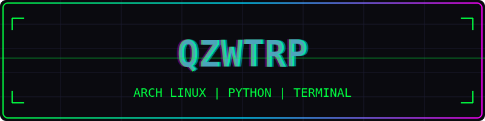

<div align="center">

<p align="center">
  
</p>

<br/>

```
████████████████████████████████████████
██  ▓▓▓▓▓▓▓▓  ▓▓▓▓▓▓▓ ▓▓   ▓▓▓▓▓▓▓  ██
██  ▓▓       ▓▓   ▓▓ ▓▓   ▓▓     ▓▓  ██
██  ▓▓  ▓▓▓  ▓▓▓▓▓  ▓▓   ▓▓▓▓▓▓▓  ██
██  ▓▓   ▓▓  ▓▓   ▓▓ ▓▓   ▓▓         ██
██   ▓▓▓▓   ▓▓   ▓▓ ▓▓▓▓▓▓▓▓▓▓▓  ██
██  ░░░░░░░░  ░░░░░░░  ░░   ░░░░░░░  ██
████████████████████████████████████████
           [SYSTEM ONLINE]
```

<br/>

### 🧠 System Status

| Metric | Value |
|--------|-------|
| **OS** | Arch Linux |
| **Shell** | fish |
| **Editor** | VS Code |
| **Lang** | Python, Lua, Bash |
| **Uptime** | `752 days` |
| **Year Progress** | `███████████░░░░░░░░░░░░░░░░░░░` `37.6%` |

<br/>

### 📡 Daily Transmission

> *"The best way to predict the future is to implement it."*
> — David Heinemeier Hansson

<br/>

### ⚡ Tech Stack

```
Python  ████████████████████████████████████████  90%
C++     ████████████████░░░░░░░░░░░░░░░░░░░░░░░░  40%
Rust    ██████████████░░░░░░░░░░░░░░░░░░░░░░░░░░░░  35%
Bash    ██████████░░░░░░░░░░░░░░░░░░░░░░░░░░░░░░░░  25%
Lua     ████████░░░░░░░░░░░░░░░░░░░░░░░░░░░░░░░░░░░░  20%
```

<br/>

### 🕒 Last Updated
`2026-05-18 09:54 UTC`

<br/>

*"The future is already here — it's just not evenly distributed."*

</div>
