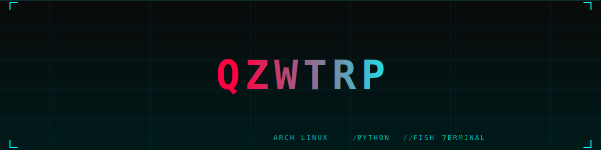

<p align="center">
  
</p>

<p align="center">
  
  
  
</p>

---

<pre align="center">
╔══════════════════════════════════════════════════════════════════╗
║                                                                  ║
║                    ░█▀▀░█░█░█▀▄░▀█▀░█▀█░█▀▄                     ║
║                    ░█▀▀░▄▀▄░█▀▄░░█░░█▀█░█▀▄                     ║
║                    ░▀░░░▀░▀░▀░▀░░▀░░▀░▀░▀░▀                     ║
║                                                                  ║
╚══════════════════════════════════════════════════════════════════╝
</pre>

<p align="center">
  <em>Developer // Hacker // Creator</em>
</p>

---

### 📊 Stats

<p align="center">
  
</p>

---

### ⚡ Tech Stack

```
Python  ████████████████████████████████████████░░░░  90%
C++     ████████████████░░░░░░░░░░░░░░░░░░░░░░░░░░  40%
Rust    ██████████████░░░░░░░░░░░░░░░░░░░░░░░░░░░░  35%
Bash    ██████████░░░░░░░░░░░░░░░░░░░░░░░░░░░░░░░░  25%
Lua     ████████░░░░░░░░░░░░░░░░░░░░░░░░░░░░░░░░░░  20%
```

---

### 🛠️ Projects

| Project | Description | Tech |
|---------|-------------|------|
| [`repo-stat`](https://github.com/qzwtrp/repo-stat) | CLI GitHub profile analyzer with Rich tables | Python, Click, httpx |

---

### 🧠 System Status

| | |
|---|---|
| **OS** | Arch Linux |
| **Shell** | fish |
| **Editor** | VS Code |
| **Uptime** | `∞` |

---

*"The future is already here — it's just not evenly distributed."*
